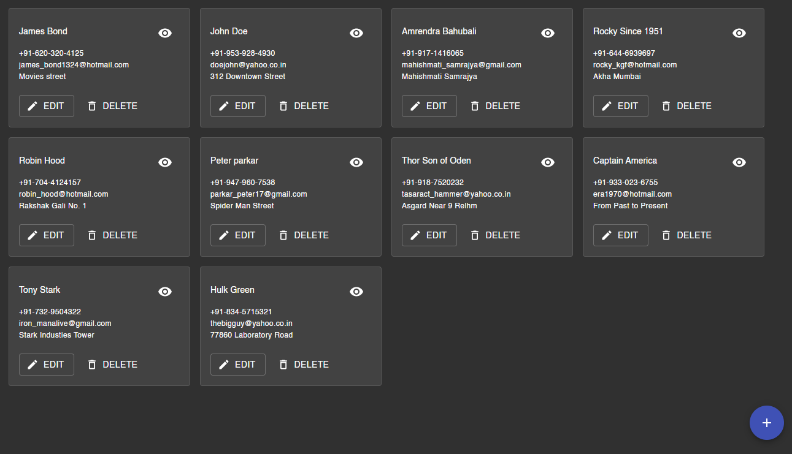
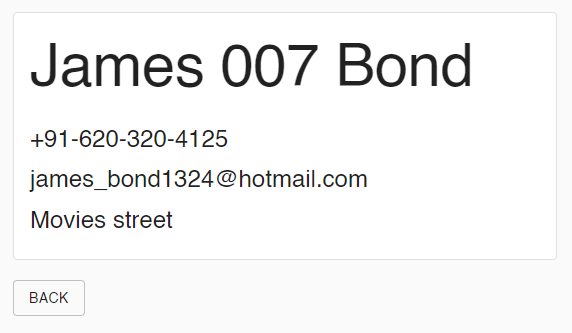
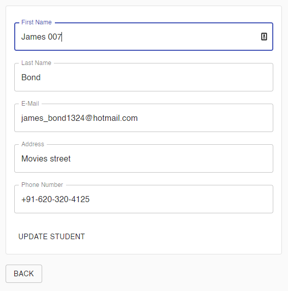
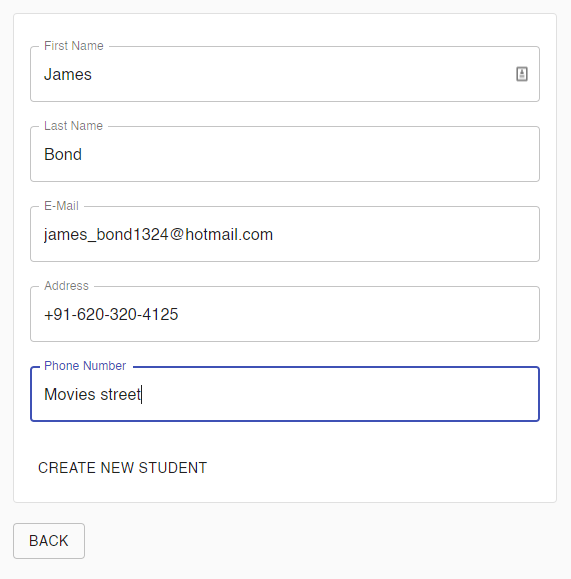

# Student Database (Complete)

## MERN stack with reactjs-toolkit - asyncThunk

## Table of Contents

---

1. [General Info](#general-info)
2. [Technologies](#technologies)
3. [Installation](#installation)

### General Info

---

This project aims at creating a simple Student Database for practice purpose to understand the react, material-ui, react-hook-form and reduxjs-toolkit with createActions, createReducers and createAsyncThunk funtctions for client side. The app is connected with backend using express js server and mongodb as database.

### Screenshot

---

#### Home Page



#### Display Single Student Page



#### Edit Student Page



#### Add Student Page



## Technologies

---

#### A list of technologies used within the project:

Client Side:

- [React.js](https://reactjs.org/): Version 17.0.2
- [Material-UI](https://material-ui.com/): Version 4.12
- [React-hook-form](https://react-hook-form.com/): Version 7.14.2
- [Reactjs/toolkit](https://redux-toolkit.js.org/): Version 1.6.1
- [React-redux](https://react-redux.js.org/): Version 7.2.4
- [React-router-dom](https://reactrouter.com/): Version 5.2.1

Server Side:

- [Express.js](https://expressjs.com/): Version 4.17.1
- [mongoose](https://mongoosejs.com/): Version 6.0.4

## Installation

---

A little intro about the installation.

```
$ git clone https://github.com/gopeshwark/react-reduxjs-toolkit-students-info.git ([mern-actions-reducers] branch)
$ cd ./react-reduxjs-toolkit-students-info/
$ npm install
$ cd ./frontend && npm install
$ npm run start:dev
```
