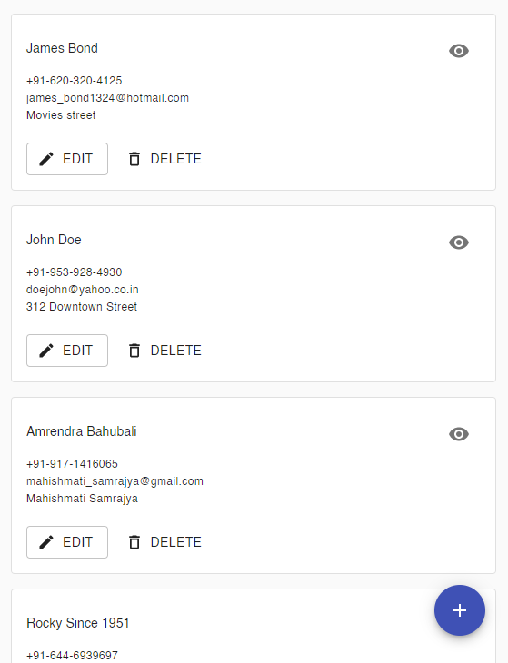

# Student Database

## reactjs-toolkit, createAction and createReducer

## Table of Contents

---

1. [General Info](#general-info)
2. [Technologies](#technologies)
3. [Installation](#installation)

### General Info

---

This project aims at creating a simple Student Database for practice purpose to understand the react, material-ui, react-hook-form and reduxjs-toolkit.

### Screenshot

---

#### Home Page



#### Display Single Student Page


#### Edit Student Page


#### Add Student Page


## Technologies

---

A list of technologies used within the project:

- [React.js](https://reactjs.org/): Version 17.0.2
- [Material-UI](https://material-ui.com/): Version 4.12
- [React-hook-form](https://react-hook-form.com/): Version 7.14.2
- [Reactjs/toolkit](https://redux-toolkit.js.org/): Version 1.6.1
- [React-redux](https://react-redux.js.org/): Version 7.2.4

## Installation

---

A little intro about the installation.

```
$ git clone https://github.com/gopeshwark/react-reduxjs-toolkit-students-info.git
$ cd ./react-reduxjs-toolkit-students-info/frontend/
$ npm install
$ npm start
```
